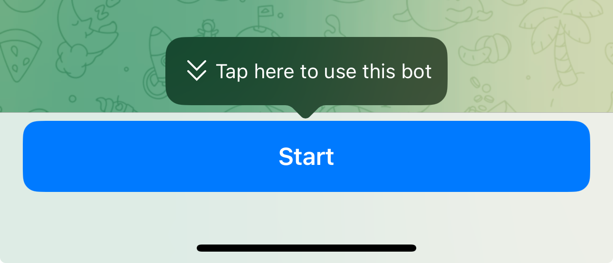

# ⛓️ ANOM Invaders

**ANOM Invaders** is a fun and easy-to-use Telegram mini app that challenges you to predict the price movement of ETH.&#x20;

Simply choose between "**PUMP**" (for a price increase) or "**DUMP**" (for a price decrease). If your prediction is correct, you'll earn 💎 points. The more consecutive correct guesses you make, the higher your multiplier, allowing you to earn even more points.&#x20;

With our mini app, participating is simple and accessible directly through Telegram allowing more users to explore and be involved with the Alphanomics ANOM Rewards program!

## How do I play ANOM Invaders?

You can access the **ANOM Invaders** mini-app through the following steps:

1. Click the button below.
2. Choose "Start" to get started.

<figure><figcaption></figcaption></figure>

To play **ANOM Invaders**, follow these steps:

1. Click on the Telegram link provided below.
2. Select and Click the blue "Play!" button or click "Launch & Battle" to start the game.

<figure><figcaption></figcaption></figure>

Once the app is launched, you’ll see the current price of ETH. Predict whether the price will rise or fall by choosing one of the following options:

* **PUMP**: Select this if you believe the price will increase.
* **DUMP**: Select this if you believe the price will decrease.

<figure><figcaption></figcaption></figure>

Once you've made your choice, watch as the price rolls for 5 suspenseful seconds before the results are revealed.

If your prediction is spot-on, you’ll score 10 points. And here’s where it gets exciting—hit a 6-guess winning streak, and your points will be multiplied, boosting your score even higher!

<figure><figcaption></figcaption></figure>

* The points cap is determined by the formula: base points \* 2^5, once you achieve a 6-guess winning streak.
* Your winning streak resets if your prediction doesn’t match the outcome or if you pause for more than 10 seconds after a round of guessing.

## How do I earn additional 💎 Points?

Unlocking the autopilot mode so the game can play for you offline, completing the tasks (both daily and one time), and also inviting your friends.

### Completing Tasks for 💎 Points

1. Navigate to the **Tasks** section to view a list of available tasks.

**Complete Tasks to Boost Your Points:**

* Complete the tasks listed under **Task** to earn additional points (Daily tasks can be repeated and completed everyday & One time tasks can only be completed once)
* When you complete a task successfully, you will see a blue tick next to it!
* Keep an eye out, as new tasks will be added regularly to help you score even more!

**Note:**

* Each task offers a different amount of points.

<figure><figcaption></figcaption></figure>

### Inviting Friends for 💎  Points

**How to Invite Friends:**

1. Go to the **Invite** section and select **Invite Friends** to share your unique invitation link.

<figure><figcaption></figcaption></figure>

**Why Invite Friends to ANOM Invaders?**

* When your friends join the ANOM Invaders mini-app using your invitation link, both of you will receive 5,000 points as a welcome bonus.
* Plus, for every 1,000 points your friend earns, you’ll collect an extra 100 points, adding to your total score!

## How to use your earned 💎 Points?

**Maximize Your Points in ANOM Invaders:**

Put the points you’ve earned to good use with these powerful upgrades:

* **Fuel Up:** Boost your gameplay by increasing the maximum number of Fuel-ups, allowing you to play more rounds.
* **Turbo Boosters:** Boost your base score for correct guesses, giving you a bigger point haul with each correct prediction.

Use your points strategically to enhance your chances and multiply your overall score in ANOM Invaders!

<figure><figcaption></figcaption></figure>

## What is the Global Leaderboard?

**Stay Competitive with Real-Time Leaderboards:**

We offer two real-time leaderboards to keep you in the loop:

* **Global Leaderboard:** Check out your ranking on a global scale and see how you stack up against players worldwide.
* **Friends Leaderboard:** Keep track of your friends' rankings and see who’s leading among your circle.

Both leaderboards update in real-time, so you’re always up-to-date with the latest standings.

## How do I unlock the Big Bonus?

&#x20;**Complete the tasks on this page:**

&#x20;Create an account via the link (make sure you connect/create your wallet to the Alphanomics platform)

Complete all the tasks on the Tasks page

<figure><figcaption></figcaption></figure>

Earn at least **10 ANOM points** on the Alphanomics platform - you will need at least 10 ANOM points in your platform account which will be a PLUS level (you earn 1 ANOM per invite on the [platform.alphanomics.io](https://platform.alphanomics.io/) )

You can check in [My Profile](https://platform.alphanomics.io/profile) page on the platform to see how many points you have:

<figure><figcaption></figcaption></figure>

Once the above is completed, simply check your eligibility, and then "Auto-Pilot" mode will be unlocked!

## FAQ

### How do I check if I'm eligible for the Big Bonus?

**Simply copy and paste the exact same address you used to sign up for the Alphanomics platform**, paste it into the field like below, click the blue button to submit, and it will tell you if you're eligible.

<figure><figcaption></figcaption></figure>

### How does Auto-Pilot mode work?

If you have successfully unlocked Auto-Pilot mode by being eligible and completing the tasks on the Bonuses page.  Every time you exit/close the app for up to 3 hours, you will automatically be earning points. &#x20;

You will see any points earned on the auto-pilot display when you start and launch the app again.  It will only run for a maximum of 3 hours earning points on autopilot before you must launch the game again.

### How do I convert my collected 💎 Points?

An announcement will be made soon on how to convert to ANOM Reward points!

