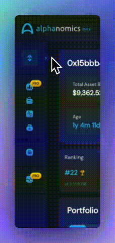

# ⛓️ Chain Support

**Alphanomics currently offers support and integration with Solana, Base, Avalanche, Polygon, Binance Smart Chain, Arbitrum, and Ethereum.**&#x20;

Our comprehensive On-Chain platforms provides coverage for the main Automated Market Makers (AMMs) on each chain, encompassing at least 95% of the total trading volume for each chain integrated.  We pride ourselves in having the best coverage on all on-chain dex transactions.

<figure><figcaption>
Chain Selection
</figcaption></figure>

Please use our Discord to submit a chain listing request, we will do our best to accommodate your request if it is met with enough demand.

IMPORTANT NOTICE: The content provided herein does not constitute an offer or invitation to buy any tokens or NFT's. The information presented includes speculative, future-oriented statements that are not assured and may vary from the final design, execution, and functionality of the technologies, systems, and components discussed. Alphanomics does not claim or guarantee the reliability or completeness of the information in this document, which may be revised at any time without prior announcement.
