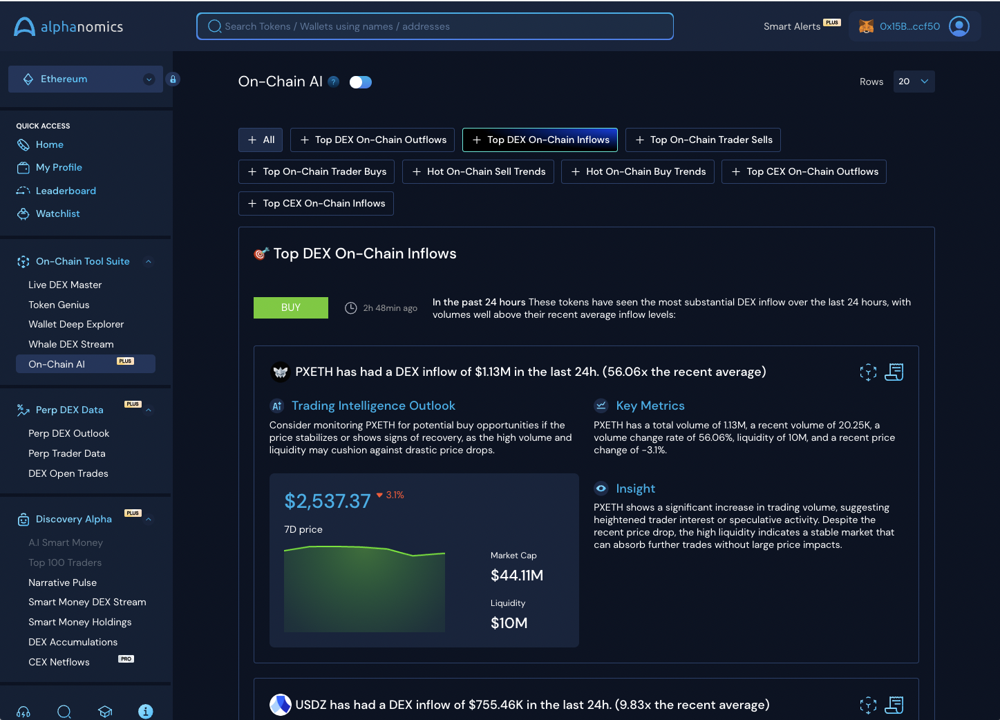

# 🔵 On-Chain AI

On-Chain AI is one of our flagship modules, designed to help users discover and monitor anomalies in on-chain data processed through the Alphanomics terminal. We handle millions of transactions daily, with an internal system that filters, processes and flags any unusual activity.

Users can access these insights and signals powered by AI, leveraging our data to surface projects that might otherwise go unnoticed. You can also narrow your focus by selecting specific sectors to refine the On-Chain AI signals.

This module offers benefits like speed, enhanced discovery, and short-term risk management, outperforming social media and manual browsing in efficiency.

<figure><figcaption></figcaption></figure>

<figure><figcaption>
Quick Action Links
</figcaption></figure>

Every project insight generated by our On-Chain AI engine includes Quick Action links, allowing you to easily add projects to your watchlist and conduct a deeper analysis using Token Genius.

### Advanced AI Insight Summary

For our PRO users, we offer a powerful AI-driven feature that processes thousands of relevant on-chain transactions daily, filtering out key data and compiling it into a comprehensive report. This feature saves you hours of manual analysis by delivering an essential summary of daily on-chain activity.

Designed to save time, it highlights and contextualizes trend data, providing a clear and concise outlook on what's happening on-chain.

<figure><figcaption></figcaption></figure>
